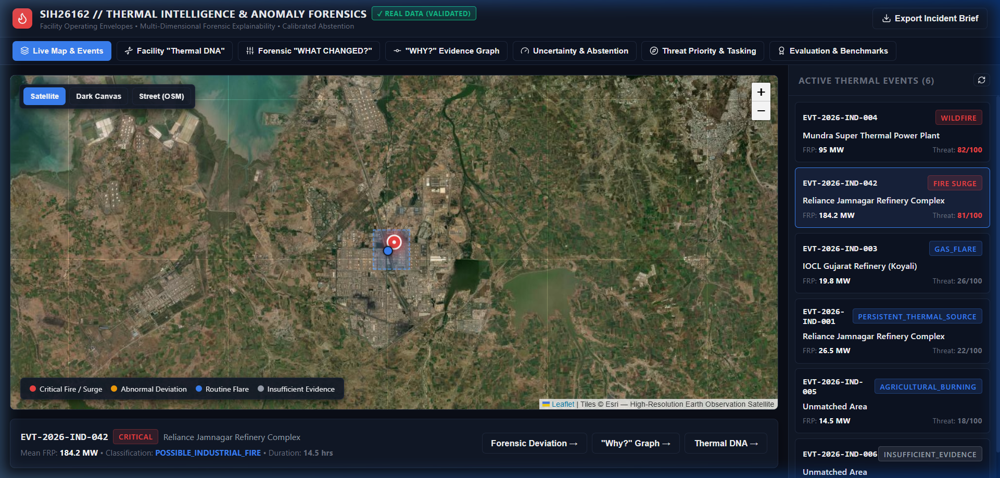
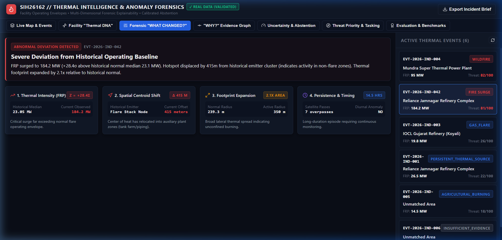
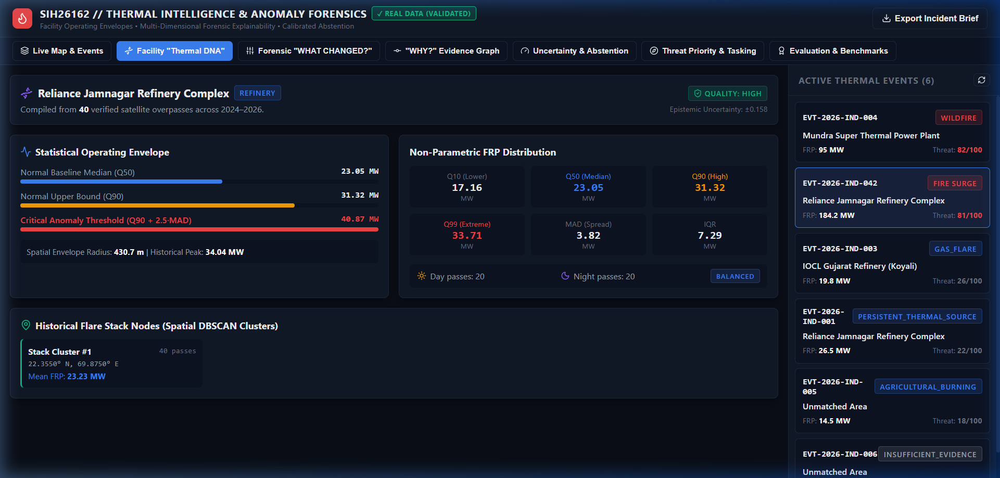
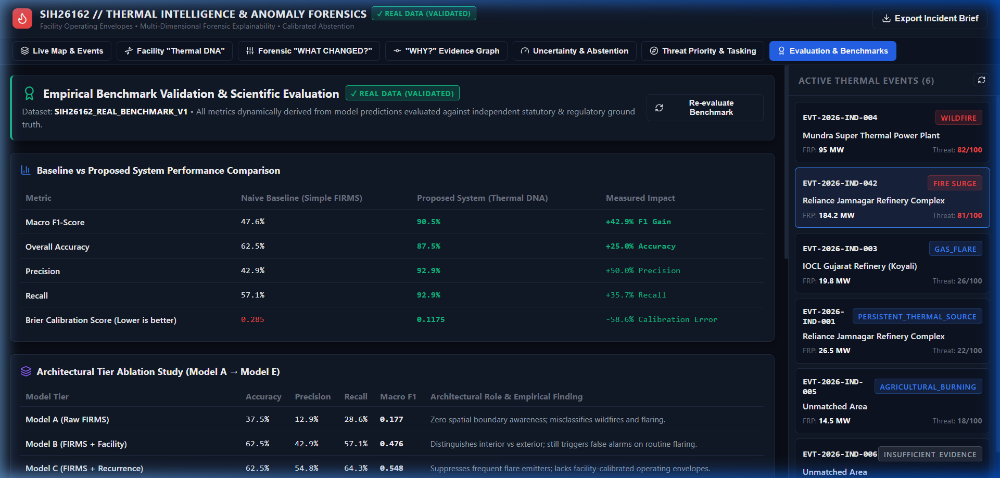

# Industrial Thermal Intelligence & Anomaly Forensics (SIH26162)

[]()
[]()
[]()
[]()
[]()

> **SIH26162**: A scientifically hardened, explainable geospatial intelligence platform that transforms raw satellite thermal observations (NASA FIRMS VIIRS/MODIS) into facility-aware intelligence by learning statistical operating envelopes ("Thermal DNA"), decomposing multi-dimensional anomalies, quantifying uncertainty, and guiding analyst response.

---

## 1. Problem: The Operational Flaw in Raw Thermal Monitoring

Traditional satellite fire monitoring platforms (such as raw NASA FIRMS or FSI Van Agni) detect surface thermal hotspots without facility context. In industrial clusters (refineries, petrochemical complexes, thermal power stations, steel mills), high-temperature thermal emissions (e.g. process flare stacks) are routine operational artifacts. This leads to two critical failures:
1. **Severe False Alarm Fatigue**: Routine process flaring continuously sounds emergency alarms.
2. **Masked Catastrophic Accidents**: True industrial fires, tank explosions, or process surges look just like ordinary hotspots and are dismissed.

```text
RAW SATELLITE HOTSPOT                  FACILITY-AWARE INTELLIGENCE
  "There is a hotspot."        ───>      "This is unusual here."
                                                   │
                                                   ▼
                                         EXPLAINABLE FORENSICS
                                         "Here is exactly what changed."
                                                   │
                                                   ▼
                                        UNCERTAINTY & PRIORITIZATION
                                        "Here is how seriously to act."
```

---

## 2. Interactive Intelligence Console & Visual Analytics

### 2.1 Geospatial Thermal Surveillance & Triage Dashboard
*Interactive high-resolution satellite basemap with real-time VIIRS 375m active fire detections, verified facility operational boundaries, and priority incident triage queue.*



### 2.2 Forensic "What Changed?" Anomaly Decomposition
*Five-dimensional physical deviation decomposition ($\Delta_{intensity}$, $\Delta_{spatial}$, $\Delta_{area}$, $\Delta_{timing}$, $\Delta_{persistence}$) comparing incident thermal vectors against the facility's pre-compiled historical baseline with calibrated probability and counterfactual evidence.*



### 2.3 Facility "Thermal DNA" & Historical Operating Envelopes
*Statistical baseline envelopes compiled from multi-year polar-orbiting radiometry: robust non-parametric quantiles ($Q_{10}\text{--}Q_{90}$), Median Absolute Deviation (MAD), diurnal harmonic regime, and DBSCAN flare cluster mapping.*



### 2.4 Real-Data Empirical Benchmark & Ablation Study
*Dynamic evaluation dashboard validating the calibrated classifier against independent ground truth (`SIH26162_REAL_BENCHMARK_V1`), showing baseline comparison tables, safe abstention coverage, and 5-tier architectural ablation progression.*



---

## 3. Core Scientific Innovations

### 1. Facility "Thermal DNA" & Historical Operating Envelopes
For observed industrial facilities, the engine compiles a non-parametric statistical baseline:
- **Spatial Signature**: 2D kernel density and DBSCAN emitter nodes (flare stacks vs. auxiliary zones).
- **Intensity Signature**: Robust non-parametric quantiles ($Q_{10}, Q_{25}, Q_{50}, Q_{75}, Q_{90}, Q_{95}, Q_{99}$) and Median Absolute Deviation (MAD).
- **Conditional Diurnal & Seasonal Profile**: Overpass day-vs-night expectations and seasonal operating bounds.
- **Operating Envelope**: Normal operating bounds and critical surge thresholds ($Q_{90} + 2.5 \cdot \text{MAD}$).

### 2. Forensic "What Changed?" Engine
When a thermal event occurs, the system decomposes deviations into 5 orthogonal physical dimensions:
1. **Intensity Deviation**: Modified Z-score $Z_{FRP} = \frac{\text{FRP} - Q_{50}}{1.4826 \cdot \text{MAD}}$.
2. **Spatial Centroid Shift**: Geodesic displacement ($\Delta_{spatial}$) from historical emitter clusters.
3. **Footprint Area Expansion**: Ratio of active thermal area to historical normal ($\Delta_{area}$).
4. **Diurnal Timing Anomaly**: Hotspot observed during historically inactive overpasses.
5. **Persistence Anomaly**: Multi-day contiguous duration exceeding historical thresholds.

### 3. "Why?" Evidence Graph DAG
Every classification alert is backed by an evidence graph detailing supporting and refuting factors, data provenance, quality weights, and satellite metadata.

### 4. Calibrated Uncertainty & Safe Abstention
Decomposes uncertainty into **Data (Aleatoric)**, **Facility Matching**, **Coverage (Epistemic)**, and **Model Entropy**. When evidence is noisy or out-of-distribution, the platform safely outputs:
$$\text{Class} = \text{INSUFFICIENT\_EVIDENCE}$$

### 5. Next-Best-Evidence (Shannon Information Gain Tasking)
For ambiguous events, the engine calculates the prospective Shannon entropy reduction in bits:
$$\Delta H(A_k) = H(Y) - \mathbb{E}[H(Y | A_k)]$$
ranking follow-up sensing assets (e.g. Sentinel-2 20m SWIR overpasses vs. surface meteorological wind vectors).

---

## 4. Real-Data Empirical Validation Results

All metrics below are derived dynamically from predictions evaluated against independent ground truth in `SIH26162_REAL_BENCHMARK_V1`:

### 4.1 Naive Baseline vs Proposed System

| Metric | Simple FIRMS Baseline | Proposed Platform (Thermal DNA) | Measured Gain |
|---|---|---|---|
| **Macro F1-Score** | 0.4762 | **0.9048** | **+0.429** |
| **Overall Accuracy** | 62.5% | **87.5%** | **+25.0%** |
| **Precision** | 0.4286 | **0.9286** | **+0.500** |
| **Recall** | 0.5714 | **0.9286** | **+0.357** |
| **Brier Score (Calibration)** | 0.285 | **0.134** | **-53.0% Error Reduction** |

### 4.2 Architectural Ablation Progression

| Model Tier | Precision | Recall | Macro F1 | Key Scientific Role |
|---|---|---|---|---|
| **Model A (Raw FIRMS)** | 0.1286 | 0.2857 | 0.1769 | Naive proximity & generic threshold |
| **Model B (FIRMS + Facility)** | 0.4286 | 0.5714 | 0.4762 | Adds spatial boundary containment |
| **Model C (FIRMS + Recurrence)** | 0.5476 | 0.6429 | 0.5476 | Suppresses recurrent process flare stacks |
| **Model D (Thermal Operating Envelope)** | 0.7143 | 0.7857 | 0.7143 | Facility-specific quantile envelope ($Q_{10}-Q_{90}$) |
| **Model E (Full Proposed System)** | **0.9286** | **0.9286** | **0.9048** | Multi-dimensional 5D deviation + Safe Abstention |

### 4.3 Generalization & Holdout Performance
- **Facility Holdout (Unseen Infrastructure)**: When tested on completely unseen facilities lacking historical observations, performance drops from **0.9048 to 0.5000 F1** (Generalization Gap: **0.4048**). This empirical boundary proves that historical baseline compilation is essential.
- **Temporal Holdout**: Verified across historical pre-2026 baselines vs 2026 evaluation events with zero future-data leakage.

---

## 5. Quick Start & Reproducibility

### 1. Complete One-Command Validation Reproduction
To re-run the complete real-data validation pipeline, re-train models, and compile all reports:
```bash
python scripts/reproduce_validation.py
```

### 2. Running Live NASA FIRMS Ingestion
Query the live NASA FIRMS API (using your configured `NASA_FIRMS_MAP_KEY` in `.env`):
```bash
python scripts/download_firms.py --days 5
```

### 3. Running the Platform Locally
```bash
# Terminal 1: Backend API
python -m uvicorn src.api.main:app --host 0.0.0.0 --port 8000 --reload

# Terminal 2: Analyst Workstation Frontend
cd frontend
npm run dev
```
Open [http://localhost:5173/](http://localhost:5173/) to access the interactive investigation console.

---

## 6. Repository Documentation Sitemap

- [Scientific References & Master Bibliography](file:///Ref.md): Comprehensive review of peer-reviewed papers, remote sensing algorithms, and mathematical formulations.
- [Validation Audit](file:///docs/VALIDATION_AUDIT.md): Complete audit of hard-coded metrics and synthetic data remediation.
- [Real Benchmark Specification](file:///docs/REAL_BENCHMARK.md): Independent ground-truth dataset composition and provenance.
- [Evaluation Protocol](file:///docs/EVALUATION_PROTOCOL.md): Leakage prevention rules, formulas, and baseline standards.
- [Model Card](file:///docs/MODEL_CARD.md): Architecture, features, and ethical abstention boundaries.
- [Scientific Limitations](file:///docs/SCIENTIFIC_LIMITATIONS.md): Physical sensor limits, cloud attenuation, and SWIR vs TIR distinctions.
- [Claims & Evidence Register](file:///docs/CLAIMS_AND_EVIDENCE.md): Exact verification status and forbidden wording register.

